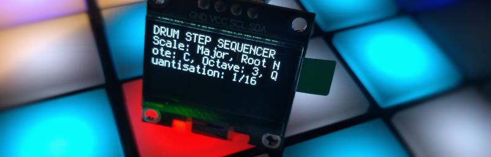

# Launchpad95

Improved Novation Launchpad remote scripts with Instrument Mode, Scales, Step Sequencer and Device Controller.

This is a fork of [Launchpad95](https://github.com/hdavid/Launchpad95) with the following changes:

* Added OLED support to drive a display attached to a Raspberry Pi Pico, consisting of code that runs on the [host computer](./DisplayHost) and code that runs on the [Raspberry Pi Pico](DisplayCircuitPython)
* [Updated documentation in Markdown format](web/README.md) for easier editing and improved readability, focusing on newer (RGB) models
